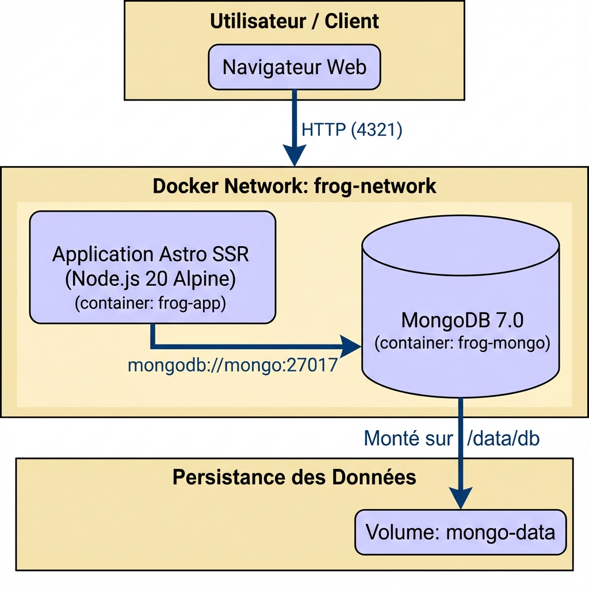
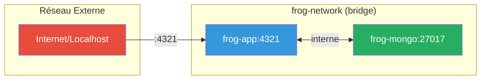

# Frog Generator - Application Web Dockerisée

Ce projet a pour objectif de conteneuriser une application web complète (front-end Astro, API, base de données MongoDB) en utilisant Docker et Docker Compose, afin de garantir un déploiement reproductible et isolé sur n'importe quelle machine.

---

## 1. Schéma d'Architecture

Le schéma ci-dessous présente l'architecture multi-conteneurs de l'application, les réseaux, les volumes et les flux de communication principaux.



---

## 2. Prérequis

| Outil | Version Minimale | Description |
|-------|------------------|-------------|
| **Docker Engine** | 20.10.0+ | Moteur de conteneurisation |
| **Docker Compose** | v2.0.0+ | Orchestration multi-conteneurs |
| **Git** | 2.0+ | Clonage du dépôt |

**Systèmes d'exploitation supportés :**
- Linux (natif)
- Windows (avec WSL2)
- macOS

---

## 3. Procédure de Déploiement

### 3.1. Configuration Initiale

**Cloner le dépôt :**

```bash
git clone https://github.com/votre-utilisateur/frog-generator.git
cd frog-generator
```

**Créer le fichier d'environnement :**

Copiez le fichier `.env.example` et renommez-le en `.env`. Ce fichier centralise toutes les variables de configuration.

```bash
cp .env.example .env
```

**Configurer les variables d'environnement :**

Modifiez le fichier `.env` avec vos propres valeurs :

```env
# Clé d'accès pour l'API Unsplash
# Obtenez une clé gratuite sur https://unsplash.com/developers
UNSPLASH_ACCESS_KEY="VOTRE_CLÉ_D'ACCÈS_UNSPLASH"

# URI de connexion MongoDB (optionnel en mode Docker)
MONGODB_URI="mongodb://mongo:27017/frog-generator"
```

> [!TIP]
> En mode Docker, la variable `MONGODB_URI` est automatiquement configurée dans `docker-compose.yml`. Vous n'avez besoin de la modifier que pour un déploiement personnalisé.

---

### 3.2. Build et Lancement

Une fois la configuration terminée, lancez l'ensemble de la stack avec Docker Compose :

```bash
docker-compose up --build -d
```

| Option | Description |
|--------|-------------|
| `--build` | Force la reconstruction des images si les Dockerfiles ont changé |
| `-d` | Lance les conteneurs en mode détaché (arrière-plan) |

**Vérifier le statut des conteneurs :**

```bash
docker-compose ps
```

**Consulter les logs :**

```bash
# Tous les services
docker-compose logs -f

# Un service spécifique
docker-compose logs -f app
```

---

### 3.3. Accès aux Services

| Service | URL | Description |
|---------|-----|-------------|
| **Application Frog Generator** | http://localhost:4321 | Interface utilisateur principale |

---

### 3.4. Arrêt des Services

**Arrêter les conteneurs :**

```bash
docker-compose down
```

**Arrêter et supprimer les volumes (supprime les données) :**

```bash
docker-compose down -v
```

> [!CAUTION]
> L'option `-v` supprime définitivement toutes les données de la base de données MongoDB !

---

## 4. Description des Services

| Service | Description | Port Exposé | Image |
|---------|-------------|-------------|-------|
| **app** | Application Astro SSR avec Node.js, servant l'interface utilisateur et l'API | `4321` | `node:20-alpine` (multi-stage) |
| **mongo** | Base de données MongoDB pour la persistance des données utilisateur | `27017` (interne) | `mongo:7.0` |

---

## 5. Architecture et Choix Techniques

### 5.1. Réseau

- **frog-network** : Réseau bridge isolé permettant la communication sécurisée entre les conteneurs `app` et `mongo`. Seul le port `4321` est exposé vers l'extérieur.



### 5.2. Persistance des Données

La persistance des données est garantie par l'utilisation de volumes Docker nommés :

| Volume | Description | Chemin dans le conteneur |
|--------|-------------|--------------------------|
| `mongo-data` | Données de la base MongoDB | `/data/db` |

> [!IMPORTANT]
> Le volume `mongo-data` n'est **pas** supprimé lors d'un `docker-compose down`, ce qui préserve vos données entre les redémarrages.

### 5.3. Sécurité et Bonnes Pratiques

#### Utilisateur non-root

Le Dockerfile utilise un utilisateur non-privilégié (`astro`) pour exécuter l'application :

```dockerfile
RUN addgroup --system --gid 1001 nodejs && \
    adduser --system --uid 1001 astro
USER astro
```

Cela réduit la surface d'attaque en cas de compromission du conteneur.

#### Multi-stage Build

Le Dockerfile utilise un build multi-stage pour optimiser la taille de l'image finale :

| Stage | Rôle |
|-------|------|
| `deps` | Installation des dépendances npm |
| `builder` | Build de l'application Astro |
| `runner` | Image finale minimale avec uniquement les fichiers nécessaires |

#### Gestion des Secrets

Les secrets (clés API, mots de passe) sont gérés via des variables d'environnement chargées depuis un fichier `.env` qui est **ignoré par Git** (via `.gitignore`).

#### Images Minimales

Utilisation d'images Alpine (`node:20-alpine`, `mongo:7.0`) pour réduire :
- La taille des images
- La surface d'attaque potentielle
- Le temps de téléchargement

#### Healthchecks

Chaque service dispose d'un healthcheck pour s'assurer de son bon fonctionnement :

**Application (Astro) :**
```dockerfile
HEALTHCHECK --interval=30s --timeout=10s --start-period=5s --retries=3 \
    CMD wget --no-verbose --tries=1 --spider http://localhost:4321/ || exit 1
```

**MongoDB :**
```yaml
healthcheck:
  test: ["CMD", "mongosh", "--eval", "db.adminCommand('ping')"]
  interval: 10s
  timeout: 5s
  retries: 5
```

#### Politique de Redémarrage

Les conteneurs sont configurés avec `restart: unless-stopped`, garantissant leur redémarrage automatique en cas de crash ou de redémarrage du serveur.

---

## 6. Stack Technique

| Technologie | Version | Rôle |
|-------------|---------|------|
| **Astro** | 5.x | Framework web SSR |
| **Node.js** | 20 Alpine | Runtime JavaScript |
| **MongoDB** | 7.0 | Base de données NoSQL |
| **TailwindCSS** | 3.x | Framework CSS utilitaire |
| **Docker** | 20.10+ | Conteneurisation |
| **Docker Compose** | v2+ | Orchestration |

---

## 7. Commandes Utiles

```bash
# Démarrer les services
docker-compose up -d

# Arrêter les services
docker-compose down

# Voir les logs en temps réel
docker-compose logs -f

# Reconstruire les images
docker-compose build --no-cache

# Accéder au shell du conteneur app
docker exec -it frog-app sh

# Accéder au shell MongoDB
docker exec -it frog-mongo mongosh

# Vérifier la santé des conteneurs
docker-compose ps
```

---

## Licence

Ce projet est sous licence MIT.